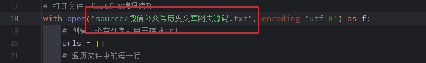

# WechatArticleCrawler

### 1.安装旧版微信-2.9.5版本
下载地址：https://priapus.lanzoux.com/i6Szeipeure

### 2.登录微信，进入公众号的历史文章页面

### 3.手动翻页，直到所有文章都加载完毕

### 4.在历史文章页面右键点击，选择查看源代码

### 5.复制打开的源代码文件到source文件夹中

### 6.修改main.py中打开源码文件的路径

### 7.修改main.py中保存PDF文件的路径

### 8.运行main.py

_解决思路参考：https://guozh.net/export-wechat-public-account-history-articles/_
